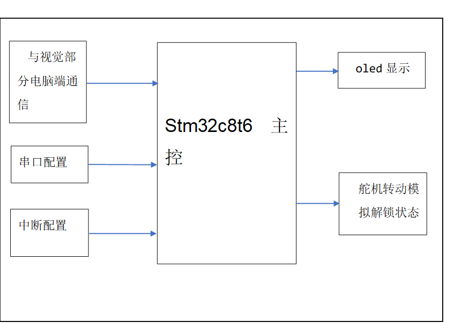
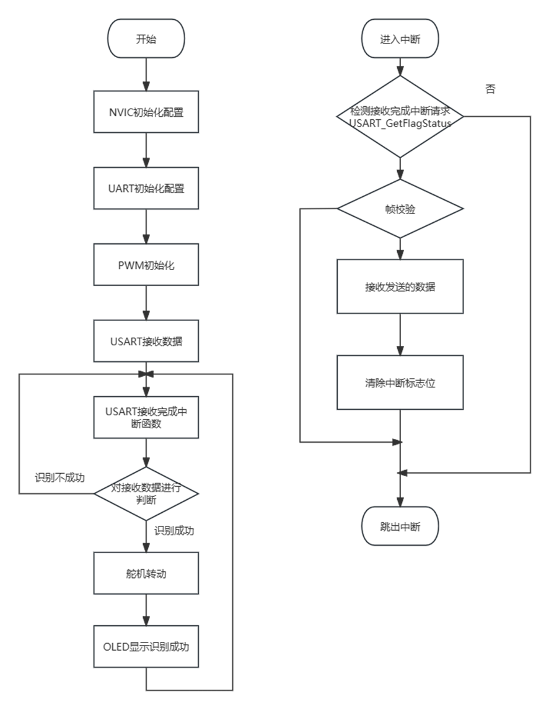
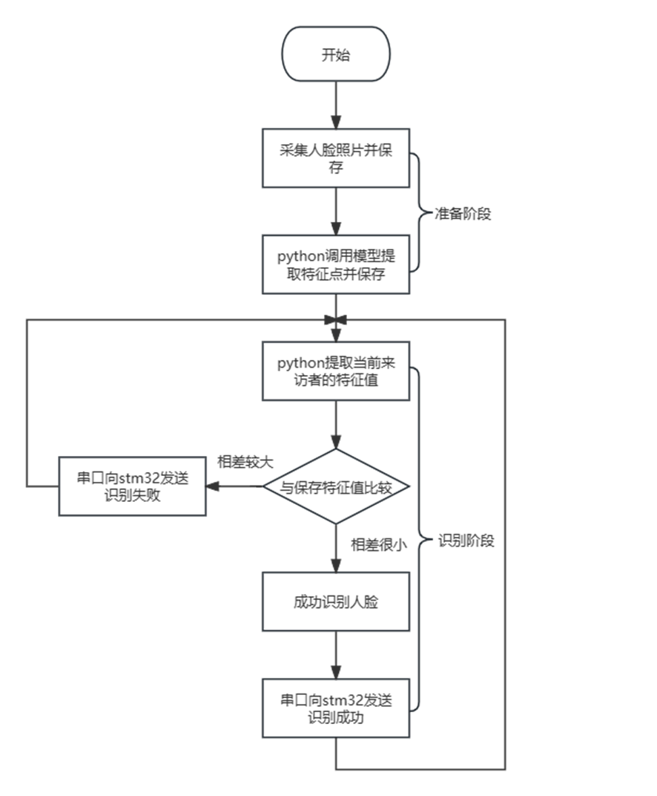

#### 设计的基本功能如下所示：

第一，采集人脸图像，并进行存储和处理。

第二，对人脸进行识别

第三，人脸识别成功可以控制门禁的开关 

系统工作流程如下：

第一，stm32初始化

第二，视觉部分对来访者进行识别 

第三，将识别情况发送给stm32 

第四，stm32控制舵机和oled显示 

#### 

####  stm32主控和用到的外设资源

#### stm32主程序流程图

#### python视觉部分程序流程图

#### 

#### 使用opencv-python dlib库检测识别

##### 使用dlib库检测到人脸

##### 采集保存用户人脸图片

##### 提取人脸特征

##### 人脸实时识别

##### 来访者信息录入，人脸识别成功效果

##### 来访者信息未录入，无法识别效果

